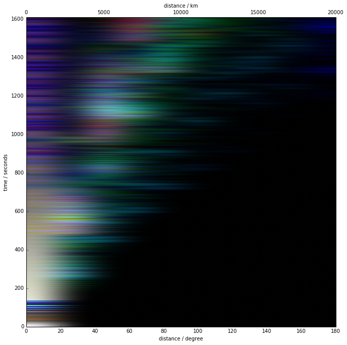

## Calculate stack


```python
%matplotlib inline
from global_stack import global_stack, load

stack = global_stack(db_name = '/opt/mc_kernel/wavefield/bwd',
                     ndist=10)
```

## Plot stack


```python
stack.plot()
```





## save and load stack


```python
stack.save('saved_stack.p')

stack_from_dist = load('saved_stack.p')
stack_from_dist.plot()
```


